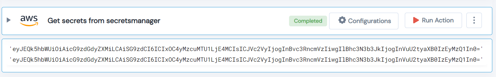

 
<h1>Get secrets from secretsmanager </h1>

## Description
This Lego used to get secrets from secretsmanager.

## Lego Details

    aws_get_secret_from_secretmanager(handle: object, SecretId: str, region: str)

        handle: Object of type unSkript AWS Connector.
        SecretId: Name of the secret.
        region: AWS Region.
## Lego Input

This Lego take three inputs handle, SecretId and region.

## Lego Output
Here is a sample output.

## See it in Action

You can see this Lego in action following this link [unSkript Live](https://us.app.unskript.io)