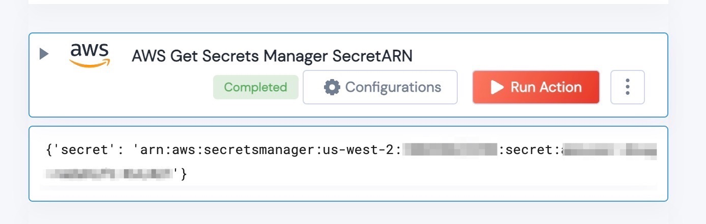

 
<h2>Get AWS Secrets Manager SecretARN</h2>

 

## Description
This Action retrieves the SecretARN from AWS Secret Manager. This can be used to make a RedShift query (amongst other things).

## Lego Details
    def aws_get_secrets_manager_secretARN(handle, region: str, secret_name:str) -> str:

        handle: Object of type unSkript datadog Connector
		region: AWS Region
		secret_name: Name of the AWS Secret to obtain

## Lego Input
This Requires an AWS Region, and the name of the Secret you wish to get the ARN for.

## Lego Output
Here is a sample output.

## See it in Action

You can see this Lego in action following this link [unSkript Live](https://us.app.unskript.io)