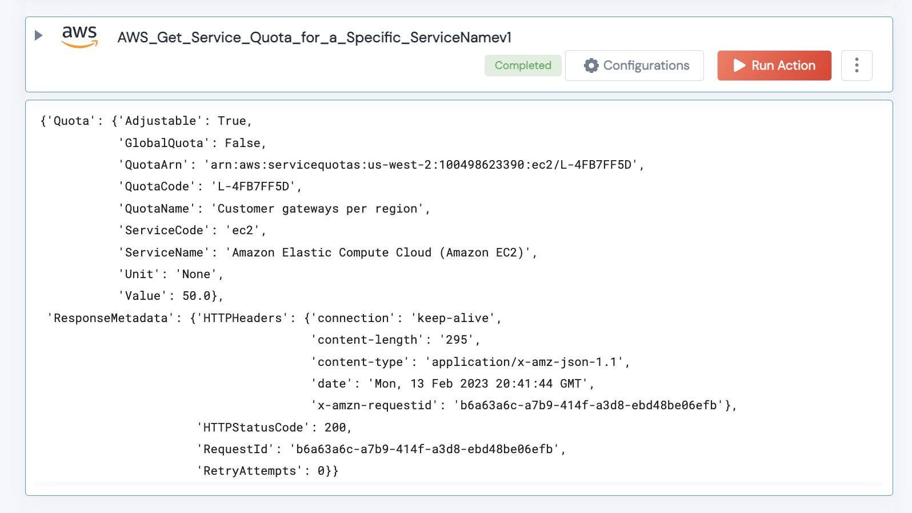

 
<h1>Get Service Quota Details </h1>

## Description
For a Given Service code and Quota Code - get the quota details.

## Lego Details

    def aws_get_service_quota_details(handle, service_code:str, quota_code:str, region:str) -> Dict:

        handle: Object of type unSkript AWS Connector
        service_code: Service Code name (ex: ec2)
        quota_code: the quota code of the service.
        region: Location of the S3 buckets.

## Lego Input
This Lego take four inputs: handle, service_code, quota_code and region.

## Lego Output

## See it in Action

You can see this Lego in action following this link [unSkript Live](https://us.app.unskript.io)

