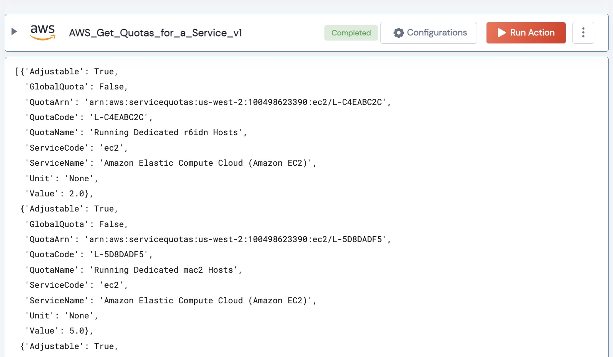

 
<h1>AWS Get Service Quotas for a Service </h1>

## Description
This Action retrieves all of the Service Quotas for a service code.

## Lego Details

    aws_get_service_quotas_v1(handle, service_code:str, region:str) -> List:

        handle: Object of type unSkript AWS Connector
        service_code: Name of the S3 bucket.
        region: Location of the S3 buckets.

## Lego Input
This Lego take three input handle, service_code and region.

## Lego Output
The output is a list of every Quota for the Service Name

## See it in Action

You can see this Lego in action following this link [unSkript Live](https://us.app.unskript.io)

