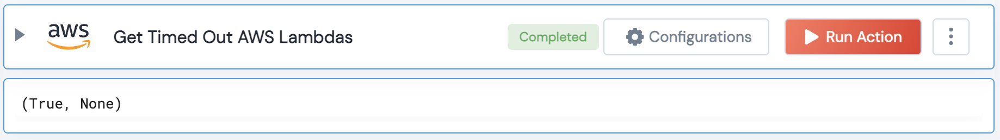

[]
(https://unskript.com/assets/favicon.png)
<h1>Get Timed Out AWS Lambdas</h1>

## Description
Get AWS Lambda functions that have exceeded the maximum amount of time in seconds that a Lambda function can run.

## Lego Details
	aws_get_timed_out_lambdas(handle, days_back:int, region:str)
		handle: Object of type unSkript AWS Connector.
		region: AWS region. Eg: "us-west-2"
		days_back: Int, (in days) Number of days to go back. Default value is 1 day.

## Lego Input
This Lego takes inputs handle,

## Lego Output
Here is a sample output.

## See it in Action

You can see this Lego in action following this link [unSkript Live](https://us.app.unskript.io)