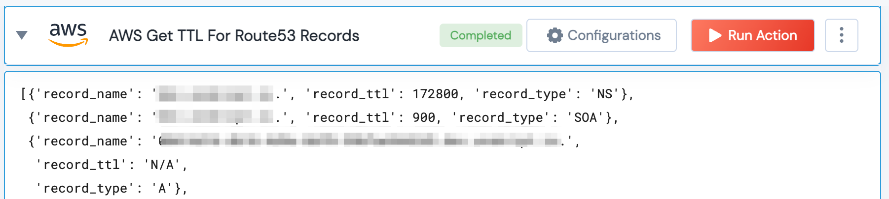

[]
(https://unskript.com/assets/favicon.png)
<h1>AWS Get TTL For Route53 Records</h1>

## Description
Get TTL for Route53 records for a hosted zone.

## Lego Details
	aws_get_ttl_for_route53_records(handle, hosted_zone_id:str)

		handle: Object of type unSkript AWS Connector.

		hosted_zone_id: ID of the Hosted zone used for routing traffic.

## Lego Input
This Lego takes two inputs handle, hosted_zone_id

## Lego Output
Here is a sample output.

## See it in Action

You can see this Lego in action following this link [unSkript Live](https://us.app.unskript.io)