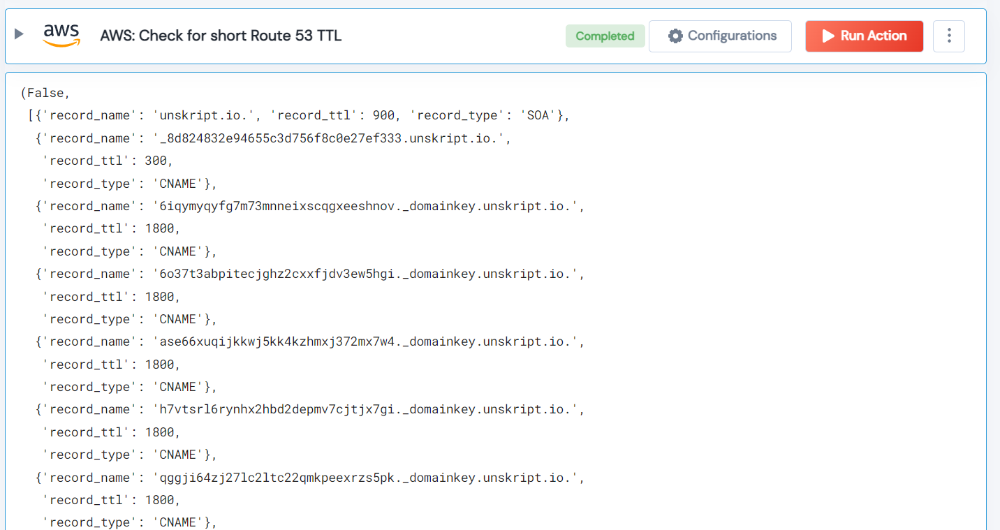

[]
(https://unskript.com/assets/favicon.png)
<h1>AWS: Check for short Route 53 TTL</h1>

## Description
Get Route53 records for a hosted zone under the given threshold (in hours).

## Lego Details
	aws_get_ttl_under_given_hours(handle, threshold: int = 1)

		handle: Object of type unSkript AWS Connector.
		threshold: (In hours) A threshold in hours to verify route 53 TTL is within the threshold.

## Lego Input
This Lego take two inputs handle and threshold

## Lego Output
Here is a sample output.

## See it in Action

You can see this Lego in action following this link [unSkript Live](https://us.app.unskript.io)