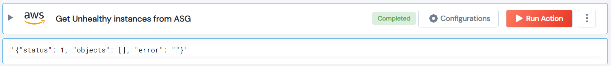

 
<h1>Get Unhealthy instances from ASG </h1>

## Description
This Lego Filter AWS unhealthy instances from Auto Scaling Group.

## Lego Details

    aws_filter_unhealthy_instances_from_asg(handle, region: str = "")

        handle: Object of type unSkript AWS Connector
        region: Optional, AWS region. Eg: “us-west-2”

## Lego Input
This Lego take two inputs handle and region. 

## Lego Output
Here is a sample output.

## See it in Action

You can see this Lego in action following this link [unSkript Live](https://us.app.unskript.io)