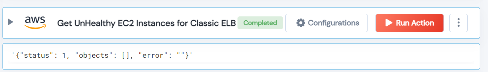

 
<h1>Get Unhealthy instances from ELB </h1>

## Description
This action filters unhealthy AWS instances from the Elastic Load Balancer.

## Lego Details

    aws_get_unhealthy_ec2_instances_for_elb(handle, elb_name: str = "", region: str = "")

        handle: Object of type unSkript AWS Connector
        elb_name: Optional, Name of the elastic load balancer.
        region: Optional, AWS region. Eg: "us-west-2"

## Lego Input
This Lego takes three inputs: handle, elb_name, and region.

## Lego Output
Here is a sample output.

## See it in Action

You can see this Lego in action following this link [unSkript Live](https://us.app.unskript.io)