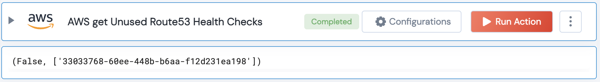

[]
(https://unskript.com/assets/favicon.png)
<h1>AWS get Unused Route53 Health Checks</h1>

## Description
Get get Unused Route53 Health Checks for hosted zones.

## Lego Details
	aws_get_unused_route53_health_checks(handle, hosted_zone_id: str = "")

		handle: Object of type unSkript AWS Connector.
		hosted_zone_id: Optional. Used to filter the health checks for a specific hosted zone.

## Lego Input
This Lego take two inputs handle and hosted_zone_id

## Lego Output
Here is a sample output.

## See it in Action

You can see this Lego in action following this link [unSkript Live](https://us.app.unskript.io)