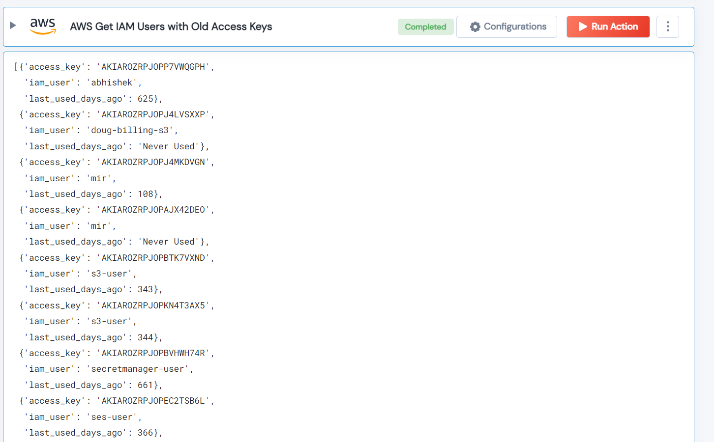

 
<h1>AWS Get IAM Users with Old Access Keys</h1>

## Description
This Lego collects the access keys that have never been used or the access keys that have been used but are older than the threshold.

## Lego Details

    aws_get_users_with_old_access_keys(handle, threshold_in_days: int = 120)

        handle: Object of type unSkript AWS Connector.
        threshold_in_days: (in days) The threshold to check the IAM user access keys older than the threshold.

## Lego Input
This Lego take two inputs handle and threshold_in_days.

## Lego Output

## See it in Action

You can see this Lego in action following this link [unSkript Live](https://us.app.unskript.io)