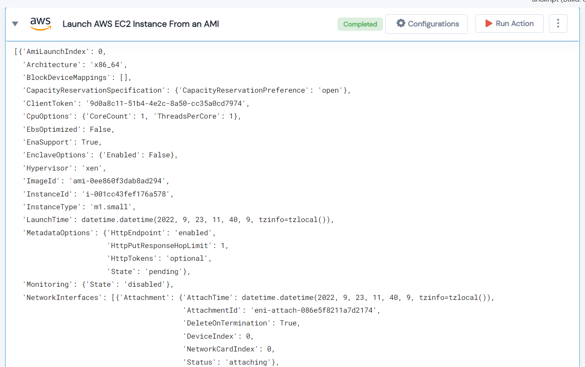

 
<h1>Launch AWS EC2 Instance From an AMI</h1>

## Description
This Lego Launch AWS EC2 Instance From an AMI and return dict of launched instance details.

## Lego Details

    aws_launch_instance_from_ami(handle, ami_id: str, region: str)

        handle: Object of type unSkript AWS Connector.
        ami_id: AMI Id to launch instance
        region: Region for instance.

## Lego Input
This Lego take three inputs handle, ami_id and region.

## Lego Output

## See it in Action

You can see this Lego in action following this link [unSkript Live](https://unskript.com)