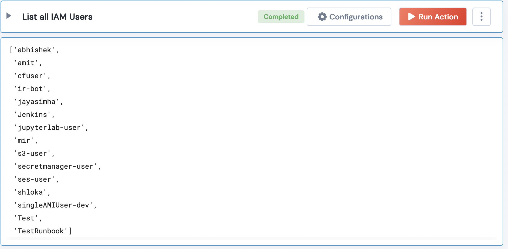

 
<h1>AWS List all IAM Users</h1>

## Description
This Lego Lists all the IAM Users.

## Lego Details

    aws_list_all_iam_users(handle)

        handle: Object of type unSkript AWS Connector.

## Lego Input
This Lego take one input: handle.

## Lego Output

## See it in Action

You can see this Lego in action following this link [unSkript Live](https://us.app.unskript.io)