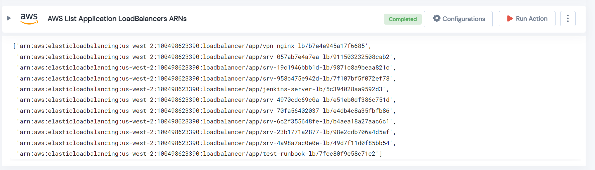

 
<h1>AWS List Application LoadBalancers ARNs </h1>

## Description
This Lego filter AWS application loadBalancers and returns a list of loadBalancers ARNs.

## Lego Details

    aws_list_apllication_loadbalancers(handle: object, region: str)

        handle: Object of type unSkript AWS Connector
        region: Region of the Classic loadbalancer.

## Lego Input
This Lego take two inputs handle and region.

## Lego Output
Here is a sample output.

## See it in Action

You can see this Lego in action following this link [unSkript Live](https://unskript.com)