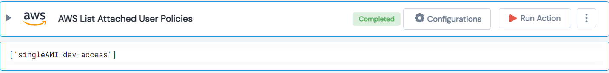

 
<h1>AWS List Attached User Policies </h1>

## Description
This Lego AWS list Attached User Policies and gives a list of policies.

## Lego Details

    aws_list_attached_user_policies(handle: object, UserName: str)

        handle: Object of type unSkript AWS Connector
        UserName: IAM user whose policies need to fetched.

## Lego Input
This Lego takes two inputs handle and UserName. 

## Lego Output
Here is a sample output.

## See it in Action

You can see this Lego in action following this link [unSkript Live](https://unskript.com)