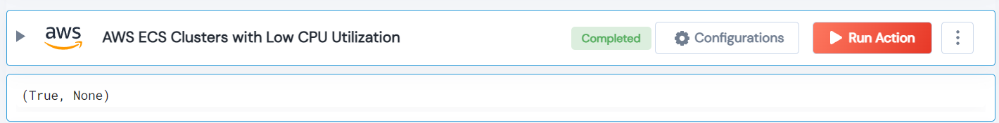

 
<h1>AWS List ECS Clusters with Low CPU Utilization</h1>

## Description
This Lego searches for clusters that have low CPU utilization.

## Lego Details

    aws_list_clusters_with_low_utilization(handle, region: str = "", threshold: int = 10)

        handle: Object of type unSkript AWS Connector.
        region: Optional, AWS region. Eg: “us-west-2”
        threshold: Optional, (In percent) Threshold to check for cpu utilization is less than threshold.

## Lego Input
This Lego take two inputs handle, threshold and region.

## Lego Output
Here is a sample output.

## See it in Action
You can see this Lego in action following this link [unSkript Live](https://us.app.unskript.io)