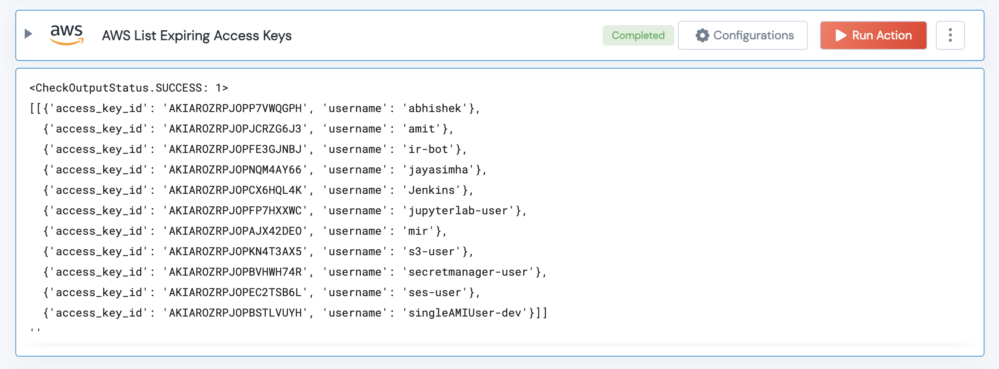

 
<h1>List Expiring Access Keys</h1>

## Description
This Lego lists all the expiring IAM Access Keys for an AWS User.

## Lego Details

    aws_list_expiring_access_keys(handle, threshold_days: int, aws_username: str)

        handle: Object of type unSkript AWS Connector.
        threshold_days: Integer, Threshold number of days to check for expiry. Eg: 30 -lists all expiring access keys within 30 days.
        aws_username: IAM username of AWS user. Eg: peralta

## Lego Input
This Lego take three inputs handle, threshold_days and aws_username.

## Lego Output

## See it in Action

You can see this Lego in action following this link [unSkript Live](https://us.app.unskript.io)