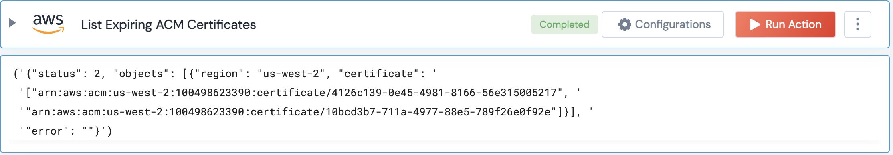

 
<h1>List Expiring ACM Certificate</h1>

## Description
This Lego lists all the expiring ACM issued SSL certificates

## Lego Details

    aws_list_expiring_acm_certificates(handle, threshold_days: int, region: str)

        handle: Object of type unSkript AWS Connector.
        threshold_days: Integer, Threshold number of days to check for expiry. Eg: 30 -lists all certificates which are expiring within 30 days.
        region: Region where the Certificate is present.

## Lego Input
This Lego take three inputs handle, threshold_days and region.

## Lego Output

## See it in Action

You can see this Lego in action following this link [unSkript Live](https://us.app.unskript.io)