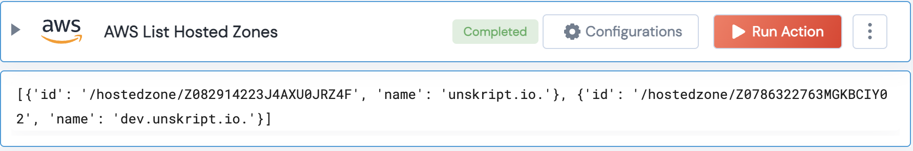

[]
(https://unskript.com/assets/favicon.png)
<h1>AWS List Hosted Zones</h1>

## Description
List all AWS Hosted zones

## Lego Details
	aws_list_hosted_zones(handle)
		handle: Object of type unSkript AWS Connector.

## Lego Input
This Lego takes one input: handle.

## Lego Output
Here is a sample output.

## See it in Action

You can see this Lego in action following this link [unSkript Live](https://us.app.unskript.io)