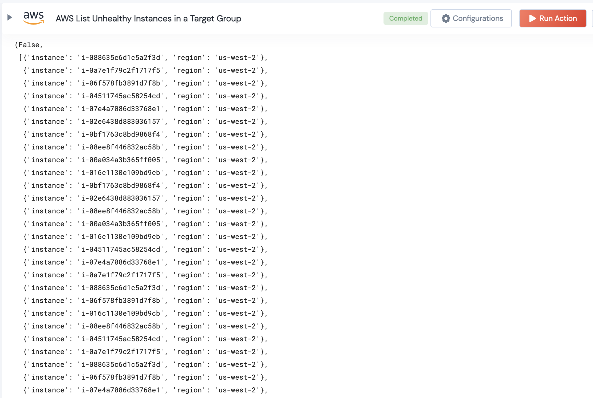

 
<h1>List Unhealthy Instances in a target group</h1>

## Description
This Lego lists all unhealthy instances in a target group

## Lego Details

    aws_list_unhealthy_instances_in_target_group(handle, region: str)

        handle: Object of type unSkript AWS Connector.
        region: Optional, Region where the Certificate is present.Eg:'us-west-2'

## Lego Input
This Lego take two inputs handle and region.

## Lego Output

## See it in Action

You can see this Lego in action following this link [unSkript Live](https://us.app.unskript.io)