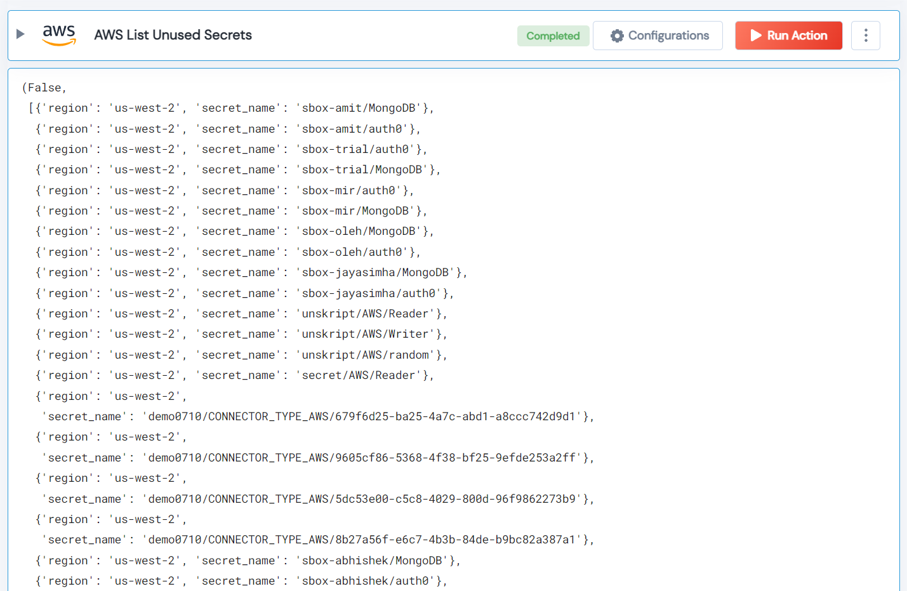

 
<h1>AWS List Unused Secrets</h1>

## Description
This Lego lists all the unused secrets from AWS by comparing the last used date with the given threshold.

## Lego Details

    aws_list_unused_secrets(handle, max_age_days: int = 30, region: str = "")
        handle: Object of type unSkript AWS Connector.
        region: Optional, AWS region. Eg: “us-west-2”
        max_age_days: The threshold to check the last use of the secret.

## Lego Input
This Lego take three inputs handle, max_age_days and region.

## Lego Output
Here is a sample output.

## See it in Action
You can see this Lego in action following this link [unSkript Live](https://us.app.unskript.io)