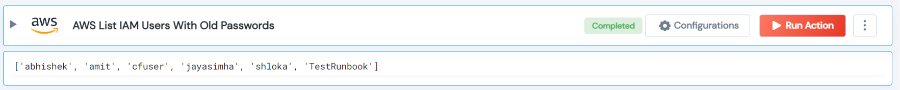

 
<h1>AWS List IAM Users With Old Passwords </h1>

## Description
This Lego filter gets all the IAM users' login profiles, and if the login profile is available, checks for the last password change if the password is greater than the given threshold, and lists those users.

## Lego Details

    aws_list_users_with_old_passwords(handle, threshold_days: int = 120)

        handle: Object of type unSkript AWS Connector.
        threshold_days: (in days) The threshold to check the IAM user password older than the threshold.

## Lego Input
This Lego take two inputs handle and threshold_days.

## Lego Output
Here is a sample output.

## See it in Action

You can see this Lego in action following this link [unSkript Live](https://us.app.unskript.io)