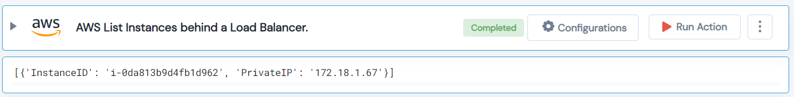

 
<h1>AWS List Instances behind a Load Balancer </h1>

## Description
This Lego list AWS Instances behind a Load Balancer..

## Lego Details

    aws_loadbalancer_list_instances(handle: object, arn: str, region: str, classic: bool)

        handle: Object of type unSkript AWS Connector.
        arn: Name of the classic loadbalancer or ARN of the ALB/NLB. Classic loadbalancer dont have ARN.
        classic: Check if the loadbalancer is Classic.
        region: Region of the Classic loadbalancer.
## Lego Input

This Lego take four inputs handle, arn, classic and region.

## Lego Output
Here is a sample output.

## See it in Action

You can see this Lego in action following this link [unSkript Live](https://us.app.unskript.io)