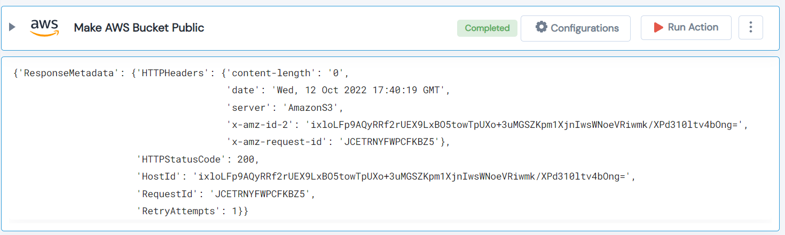

 
<h1>Make AWS Bucket Public </h1>

## Description
This Lego make an AWS Bucket Public.

## Lego Details

    aws_make_bucket_public(handle: object, name: str, enable_write: bool)

        handle: Object of type unSkript AWS Connector.
        name: Name of the bucket.
        enable_write: Set this to true for bucket to be publicly writeable.
## Lego Input

This Lego take three inputs handle, name and enable_write.

## Lego Output
Here is a sample output.

## See it in Action

You can see this Lego in action following this link [unSkript Live](https://us.app.unskript.io)