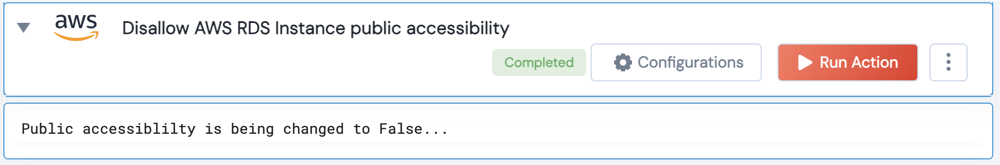

[]
(https://unskript.com/assets/favicon.png)
<h1>Disallow AWS RDS Instance public accessibility</h1>

## Description
Change public accessibility of RDS Instances to False.

## Lego Details
	aws_make_rds_instance_not_publicly_accessible(handle, db_instance_identifier: str, region: str)
		handle: Object of type unSkript AWS Connector.
		db_instance_identifier: Identifier of the RDS instance.
		region: Region of the RDS instance.

## Lego Input
This Lego takes inputs handle, db_instance_identifier, region.

## Lego Output
Here is a sample output.

## See it in Action

You can see this Lego in action following this link [unSkript Live](https://us.app.unskript.io)