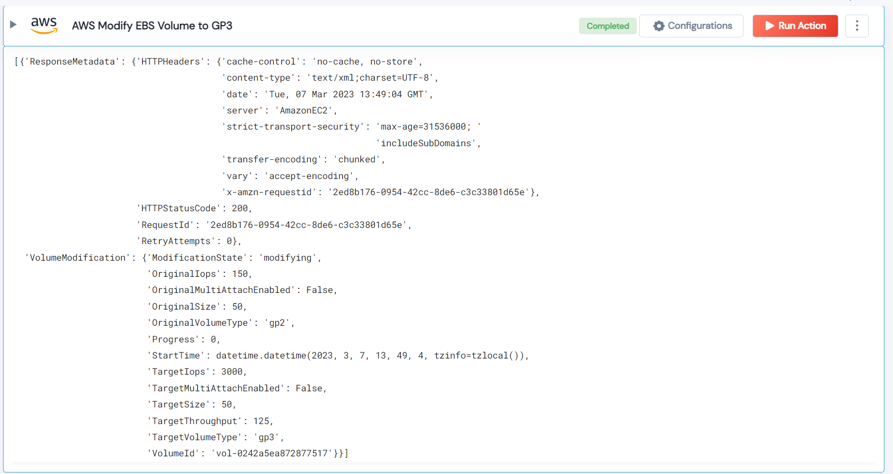

 
<h1>AWS Modify EBS Volume to GP3 </h1>

## Description
This Lego modify AWS EBS volumes to General Purpose SSD (gp3) volume type, which is designed to provide higher IOPS performance at a lower cost than the gp2 volume type.

## Lego Details

    aws_modify_ebs_volume_to_gp3(handle, region: str, volume_id: str)

        handle: Object of type unSkript AWS Connector.
        region: AWS region. Eg: “us-west-2”
        volume_id: EBS Volume ID.

## Lego Input
This Lego take three inputs handle, volume_id and region.

## Lego Output
Here is a sample output.

## See it in Action
You can see this Lego in action following this link [unSkript Live](https://us.app.unskript.io)