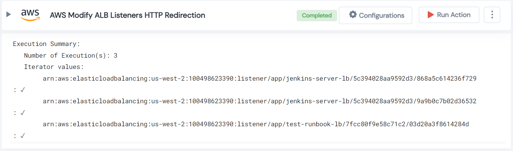

 
<h1>AWS Modify ALB Listeners HTTP Redirection </h1>

## Description
This Lego modify AWS ALB listeners HTTP redirection and returns a list of listener.

## Lego Details

    aws_modify_listener_for_http_redirection(handle, listener_arn: str, region: str)

        handle: Object of type unSkript AWS Connector
        listener_arn: List of listenerArn.
        region: Region to filter ALB listeners.

## Lego Input
This Lego take three inputs handle, listener_arn and region.

## Lego Output
Here is a sample output.

## See it in Action

You can see this Lego in action following this link [unSkript Live](https://unskript.com)