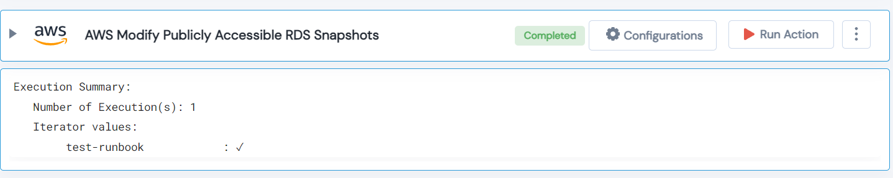

 
<h1>AWS Modify Publicly Accessible RDS Snapshots </h1>

## Description
This Lego modify AWS publicly accessible RDS snapshots.

## Lego Details

    aws_modify_public_db_snapshots(handle, db_snapshot_identifier: str, region: str)

        handle: Object of type unSkript AWS Connector
        db_snapshot_identifier: DB Snapshot Idntifier of RDS.
        region: Region of the RDS.

## Lego Input
This Lego take three inputs handle, db_snapshot_identifier and region.

## Lego Output
Here is a sample output.

## See it in Action

You can see this Lego in action following this link [unSkript Live](https://us.app.unskript.io)