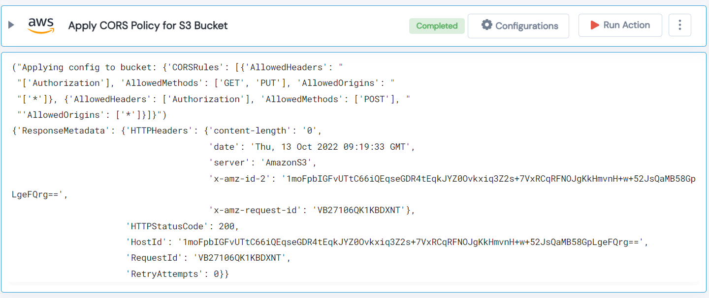

 
<h1>Apply CORS Policy for S3 Bucket </h1>

## Description
This Lego apply CORS Policy for S3 Bucket.

## Lego Details

    aws_put_bucket_cors(handle: object, name: str, corsRules: List, region: str)

        handle: Object of type unSkript AWS Connector.
        name: Name of the bucket.
        corsRules: cross-origin access configuration in JSON format.
        region: AWS region of the bucket.
## Lego Input

This Lego take four inputs handle, name, corsRules and region.

## Lego Output
Here is a sample output.

## See it in Action

You can see this Lego in action following this link [unSkript Live](https://us.app.unskript.io)