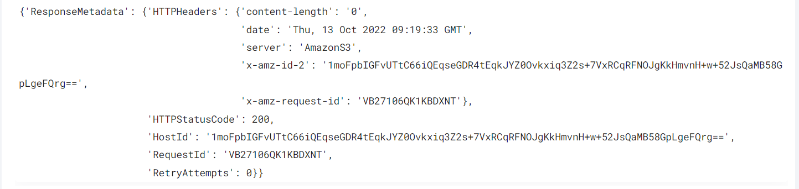

 
<h1>Apply AWS New Policy for S3 Bucket </h1>

## Description
This Lego apply AWS New Policy for S3 Bucket.

## Lego Details

    aws_put_bucket_policy(handle: object, name: str, policy: str, region: str)

        handle: Object of type unSkript AWS Connector.
        name: Name of the bucket.
        policy: Bucket policy in JSON format.
        region: AWS region of the bucket.
## Lego Input

This Lego take four inputs handle, name, policy and region.

## Lego Output
Here is a sample output.

## See it in Action

You can see this Lego in action following this link [unSkript Live](https://us.app.unskript.io)