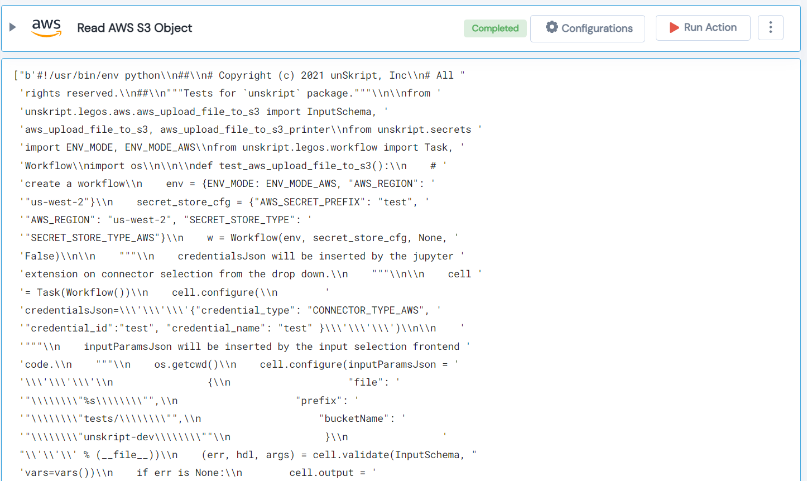

 
<h1>Read AWS S3 Object </h1>

## Description
This Lego read AWS S3 Object.

## Lego Details

    aws_read_object(handle: object, name: str, key: str)

        handle: Object of type unSkript AWS Connector.
        name: Name of the bucket of the object.
        key: Name of S3 object or Prefix.
## Lego Input

This Lego take three inputs handle, name and key.

## Lego Output
Here is a sample output.

## See it in Action

You can see this Lego in action following this link [unSkript Live](https://us.app.unskript.io)