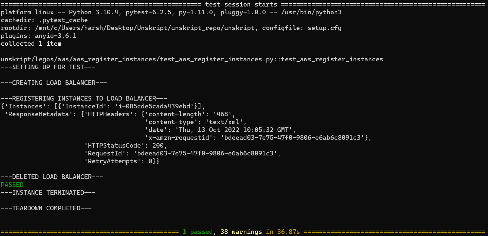

 
<h1>Register AWS Instances with a Load Balancer </h1>

## Description
This Lego register AWS Instances with a Load Balancer.

## Lego Details

    aws_register_instances(handle: object, elb_name: str, instance_ids: List, region: str)

        handle: Object of type unSkript AWS Connector.
        elb_name: Name of the Load Balancer.
        instance_ids: List of instance IDs.
        region: AWS Region of the ELB.
## Lego Input

This Lego take four inputs handle, elb_name, instance_ids and region.

## Lego Output
Here is a sample output.

## See it in Action

You can see this Lego in action following this link [unSkript Live](https://us.app.unskript.io)