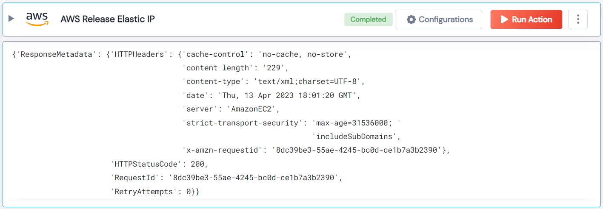

 
<h1>AWS Release Elastic IP</h1>

## Description
This Lego release AWS elastic IP for both VPC and Standard.

## Lego Details

    aws_release_elastic_ip(handle, region: str, public_ip: str, allocation_id: str)

        handle: Object of type unSkript AWS Connector.
        public_ip: Public IP address of the Elastic IP to release.
        allocation_id: Allocation ID of the Elastic IP to release.
        region: AWS Region.

## Lego Input
This Lego take three inputs handle, public_ip, allocation_id and region.

## Lego Output
Here is a sample output.

## See it in Action

You can see this Lego in action following this link [unSkript Live](https://us.app.unskript.io)