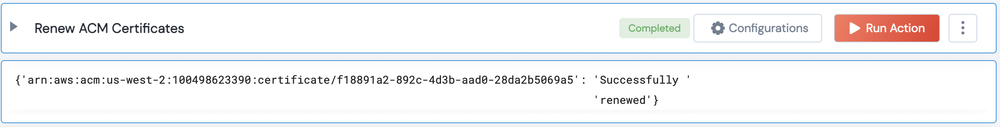

 
<h1>Renew Expiring ACM Certificate</h1>

## Description
This Lego renews all eligible expiring ACM issued SSL certificates

## Lego Details

    aws_renew_expiring_acm_certificates(handle, aws_certificate_arn: List, region: str)

        handle: Object of type unSkript AWS Connector.
        aws_certificate_arn: List, ARN of the Certificate. Eg: arn:aws:acm:us-west-2:100498623390:certificate/f18891a2-892c-4d3b-aad0-28da2b5069a5
        region: String, Region where the Certificate is present. Eg: us-west-2

## Lego Input
This Lego take three inputs handle, aws_certificate_arn and region.

## Lego Output

## See it in Action

You can see this Lego in action following this link [unSkript Live](https://us.app.unskript.io)