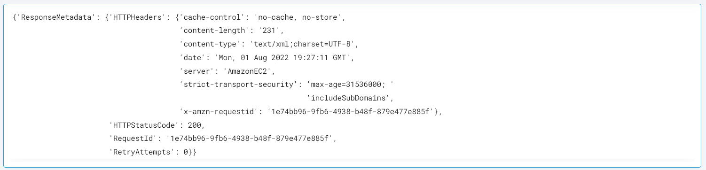

 
<h1>Restart AWS EC2 Instances </h1>

## Description
This Lego Restart the AWS EC2 Instance and gives a dict as output.

## Lego Details

    aws_restart_ec2_instances(handle: object)

        handle: Object of type unSkript AWS Connector

## Lego Input
This Lego take three inputs region, instance_ids.

## Lego Output
Here is a sample output.

## See it in Action

You can see this Lego in action following this link [unSkript Live](https://unskript.com)