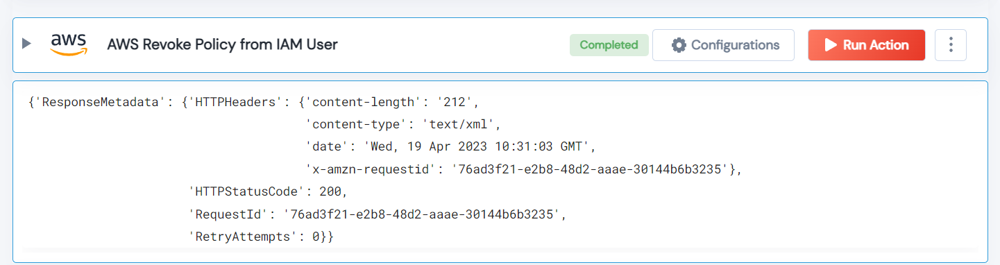

 
<h1>AWS Revoke Policy from IAM User</h1>

## Description
This Lego revoke policy from IAM User.

## Lego Details

    aws_revoke_policy_from_iam_user(handle, user_name: str, policy_arn: str)

        handle: Object of type unSkript AWS Connector.
        policy_arn: The Amazon Resource Name (ARN) of the policy.
        user_name: The name of the IAM user from whom to revoke the policy.

## Lego Input
This Lego take four inputs handle, log_group_name, log_stream_name and region.

## Lego Output
Here is a sample output.

## See it in Action

You can see this Lego in action following this link [unSkript Live](https://us.app.unskript.io)