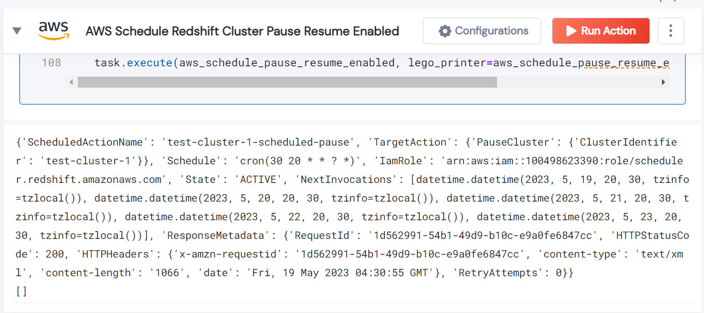

 
<h1>AWS Schedule Redshift Cluster Pause Resume Enabled</h1>

## Description
This Lego Schedule Redshift Cluster Pause Resume Enabled.

## Lego Details

    aws_schedule_pause_resume_enabled(handle,
                                      iam_role_arn: str,
                                      cluster_name: str,
                                      region: str,
                                      pause_schedule_expression: str,
                                      resume_schedule_expression: str)

        handle: Object of type unSkript AWS Connector
        iam_role_arn: The ARN of the IAM role.
        cluster_name: The name of the Redshift cluster.
        region: AWS Region.
        pause_schedule_expression: The cron expression for the pause schedule.
        resume_schedule_expression: The cron expression for the resume schedule.

## Lego Input
This Lego take six inputs handle, region, cluster_name, iam_role_arn, pause_schedule_expression and resume_schedule_expression.

## Lego Output
Here is a sample output.

## See it in Action

You can see this Lego in action following this link [unSkript Live](https://us.app.unskript.io)