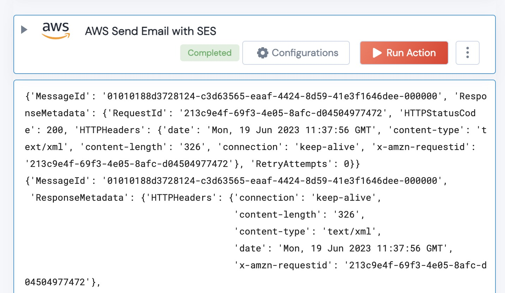

[]
(https://unskript.com/assets/favicon.png)
<h1>AWS Send Email with SES</h1>

## Description
This Action sends an Email with AWS Simple Email Service.  Input the sender and recipient addresses, a subject and the body of the message (and the AWS region for SES), and your message will be sent.

## Action Details
	aws_send_email(handle, Region:str, Sender:str, Receiver:str, Subject:str, Message:str)
		handle: Object of type unSkript AWS Connector.

		* Region: The AWS Region SES is provisioned in.
		* Sender: The verified email address to send the message (verification in SES).
		* Receiver: The email address to receive the message (note that new SES senders can only send to verified receivers for 7 days).
		* Subject: Email Subject
		* Message: The Body of the email
 
## Action Output
Here is a sample output.

## Try it Out

You Try this Action in the unSkript [Free Trial](https://us.app.unskript.io/), or using the [open source Docker image](http://runbooks.sh).