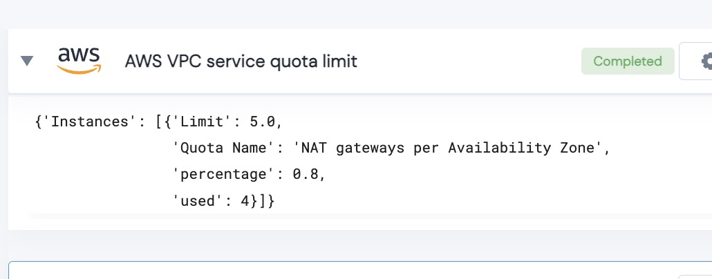

 
<h1>AWS Service Quotas for VPC </h1>

## Description
This Action compares usage for all VPC service quotas vs. your account's limit.  If any are above warning percentage - they will be output.

## Lego Details

    def aws_service_quota_limits_vpc(handle, region: str, warning_percentage: float) -> List:

        handle: Object of type unSkript AWS Connector
        warning_percentage: If % is above this value - the service will be output.
        region: Region for instance.

## Lego Input
This Lego take three inputs handle, region and warning_percentage.

## Lego Output
Here is a sample output.

## See it in Action

You can see this Lego in action following this link [unSkript Live](https://us.app.unskript.io)