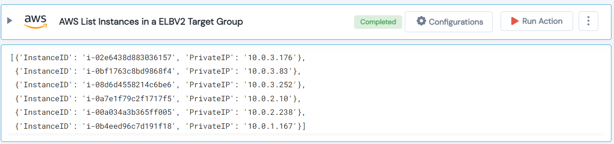

 
<h1>AWS List Instances in a ELBV2 Target Group </h1>

## Description
This Lego list AWS Instances in a ELBV2 Target Group.

## Lego Details

    aws_target_group_list_instances(handle: object, arn: str)

        handle: Object of type unSkript AWS Connector.
        arn: ARN of the Target Group.

## Lego Input

This Lego take two inputs handle and arn.

## Lego Output
Here is a sample output.

## See it in Action

You can see this Lego in action following this link [unSkript Live](https://us.app.unskript.io)