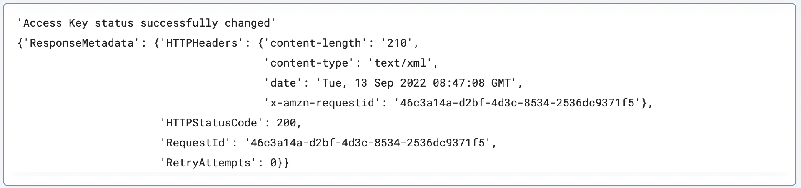

 
<h1>AWS Delete Access Key</h1>

## Description
This Lego updates the status of an old Access Key to Inactive.

## Lego Details

    aws_update_access_key(handle,aws_username: str)

        handle: Object of type unSkript AWS Connector.
        aws_access_key_id: String, Old Access Key ID of the User.
        status: AccessKeyStatus, Status to set for the Access Key Eg:Active or Inactive

## Lego Input
This Lego take three inputs handle, aws_access_key_id, and status.

## Lego Output

## See it in Action

You can see this Lego in action following this link [unSkript Live](https://us.app.unskript.io)