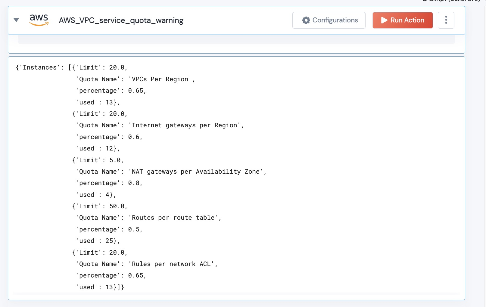

 
<h1>AWS VPC Service Quota Warning </h1>

## Description
This Action compares the AWS service quota for all VPC Services against the usage.  If the alert is over the warning threshold, the data is output as a LIst.

## Lego Details

    aws_vpc_service_quota_warning_v1(handle, region: str, warning_percentage: float) -> List

        handle: Object of type unSkript AWS Connector
        warning_percentage: Percentage. If usage/quota is over this value - it will be added to the output.
        region: Location of the S3 buckets.

## Lego Input
This Lego take three input handle, warning_percentage and region.

## Lego Output
Here is a sample output.

## See it in Action

You can see this Lego in action following this link [unSkript Live](https://us.app.unskript.io)

