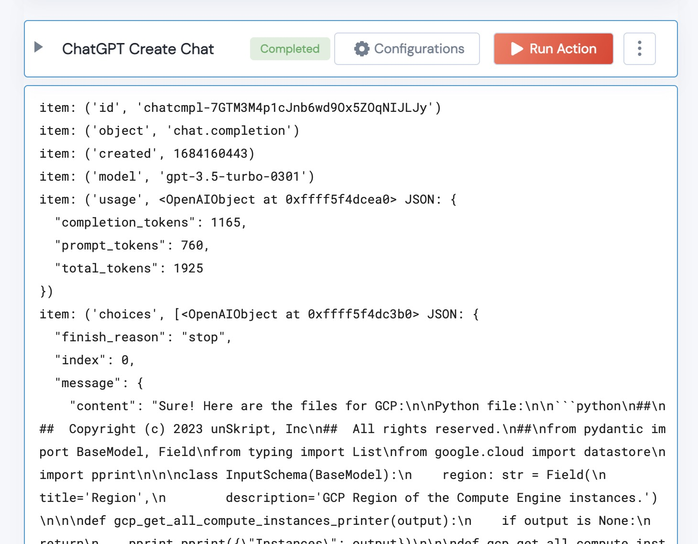

[]
(https://unskript.com/assets/favicon.png)
<h1>ChatGPT Create Chat</h1>

## Description
Given a model, temperature and message (list of dictionaries), this Action will create a ChatGPT Chat.

## Lego Details
	chatgpt_create_chat(handle, model: str, messages:list, temperature:float)
		handle: Object of type unSkript CHATGPT Connector.

	Model: The ChatGPT Model you wish to use
	Temperature: a number from 0 to 2.  The bigger the number the more random the response is.
	Messages: the messaages used to seed the conversation.

## Lego Input
This Lego takes inputs handle, model, temperature and messages

## Lego Output
Here is a sample output.

## See it in Action

You can see this Lego in action following this link [unSkript Live](https://us.app.unskript.io)