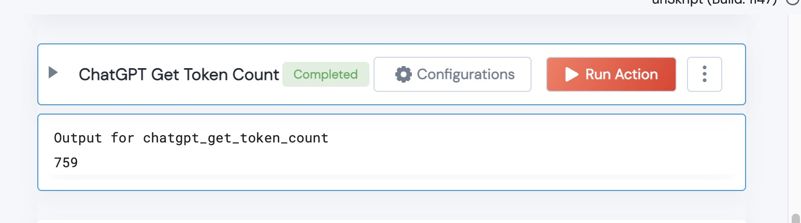

[]
(https://unskript.com/assets/favicon.png)
<h1>ChatGPT Get Token Count</h1>

## Description
Given a ChatGPT model and input message, this action will calculate the input tokens used.

## Lego Details
	chatgpt_get_token_count(handle, messages: list, model: str)
		handle: Object of type unSkript CHATGPT Connector.
		messages: the message that we want to count for token usage.
		model: the chatgpot model that will be used

## Lego Input
This Lego takes inputs handle, messages and model.

## Lego Output
Here is a sample output.

## See it in Action

You can see this Lego in action following this link [unSkript Live](https://us.app.unskript.io)