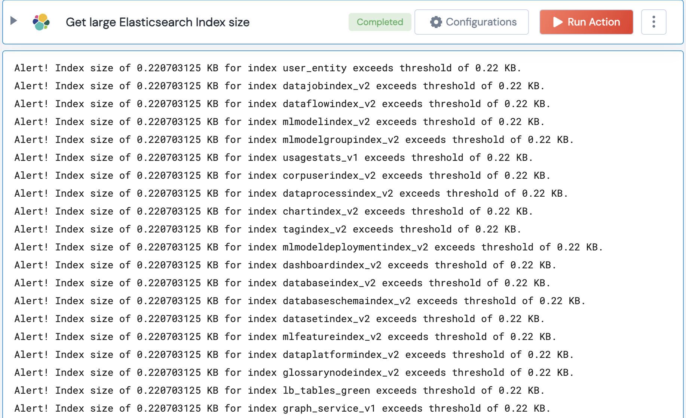

[]
(https://unskript.com/assets/favicon.png)
<h1>Get large Elasticsearch Index size</h1>

## Description
This action checks the sizes of all indices in the Elasticsearch cluster and compares them to a given threshold.

## Lego Details
	elasticsearch_check_large_index_size(handle, threshold: float = 1000)
		handle: Object of type unSkript ELASTICSEARCH Connector.
		threshold: The threshold for index size in KB.

## Lego Input
This Lego takes inputs handle, threshold.

## Lego Output
Here is a sample output.

## See it in Action

You can see this Lego in action following this link [unSkript Live](https://us.app.unskript.io)