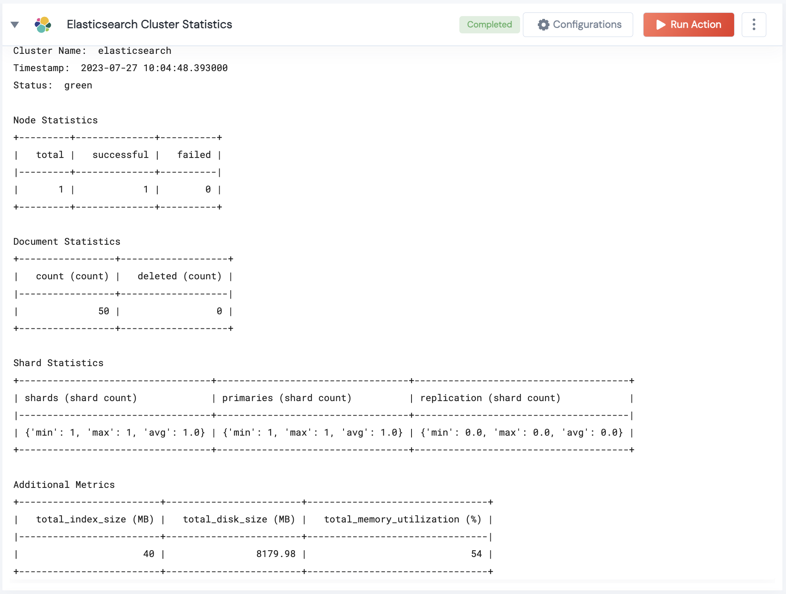

 
<h1>Elasticsearch Cluster Statistics </h1>

## Description
This Lego checks fetches fetches total index size, disk size, and memory utilization and information about the current nodes and shards that form the cluster.

## Lego Details

    elasticsearch_cluster_statistics(handle: object)

        handle: Object of type unSkript Elasticsearch Connector

## Lego Input
This Lego takes only the handle object that is returned from `task.validate(...)`

## Lego Output
Here is a sample output.

## See it in Action
You can see this Lego in action following this link [unSkript Live](https://us.app.unskript.io)
