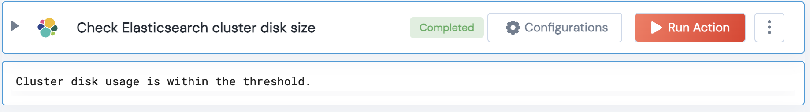

[]
(https://unskript.com/assets/favicon.png)
<h1>Check Elasticsearch cluster disk size</h1>

## Description
This action compares the disk usage percentage of the Elasticsearch cluster to a given threshold.

## Lego Details
	elasticsearch_compare_cluster_disk_size_to_threshold(handle, threshold: float=80.0)
		handle: Object of type unSkript ELASTICSEARCH Connector.
		threshold: The threshold for disk usage percentage.

## Lego Input
This Lego takes inputs handle, threshold.

## Lego Output
Here is a sample output.

## See it in Action

You can see this Lego in action following this link [unSkript Live](https://us.app.unskript.io)