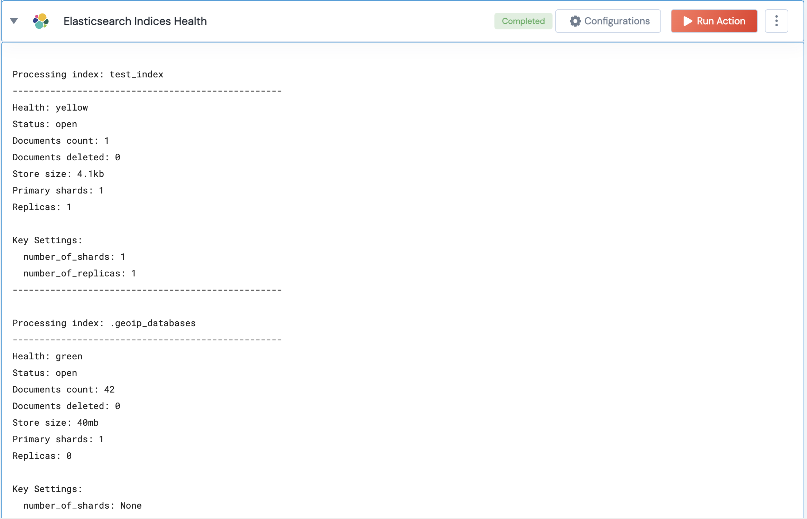

[]
(https://unskript.com/assets/favicon.png)
<h1>Get Elasticsearch index health</h1>

## Description
This action checks the health of a given Elasticsearch index or all indices if no specific index is provided.

## Lego Details
	elasticsearch_get_index_health(handle, index_name="")
		handle: Object of type unSkript ELASTICSEARCH Connector.
		index_name: Name of the index for which the health is checked. If no index is provided, the health of all indices is checked.

## Lego Input
This Lego takes inputs handle,

## Lego Output
Here is a sample output.

## See it in Action

You can see this Lego in action following this link [unSkript Live](https://us.app.unskript.io)