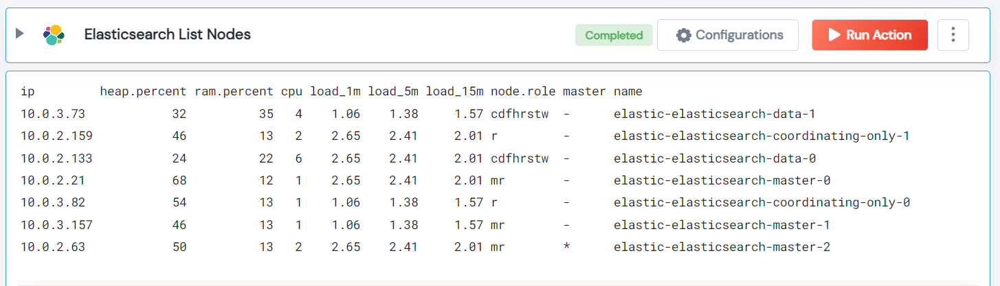

<<<<<<< HEAD
 
<h2>Elasticsearch List Nodes</h2>

 

## Description
This Lego List Elasticsearch Nodes in a Cluster.

## Lego Details

    elasticsearch_list_nodes(handle: object, host: str, port: int, api_key: str)

        handle: Object of type unSkript ElasticSearch Connector
        host: URL of your Elasticsearch server
        port: Port number at which Elasticsearch is listening
        api_key: API Key for authentication of the request

## Lego Input
This Lego take four inputs handle, host, port and api_key.

## Lego Output
Here is a sample output.

## See it in Action

You can see this Lego in action following this link [unSkript Live](https://us.app.unskript.io)
=======
 
<h1>Elasticsearch List Nodes</h1>

## Description
This Lego lists nodes in an Elasticsearch cluster.

## Lego Details

    elasticsearch_list_nodes(handle: object, host: str, port:int, api_key: str)

        handle: Object of type unSkript Elasticsearch Connector
        host: URL of your Elasticsearch server
        port: Port used by your Elasticsearch server
        region: API Key for authentication of the request

## Lego Input
This Lego take four inputs handle, host, port and api_key. 

## Lego Output
Here is a sample output.

## See it in Action
You can see this Lego in action following this link [unSkript Live](https://us.app.unskript.io)
>>>>>>> master
