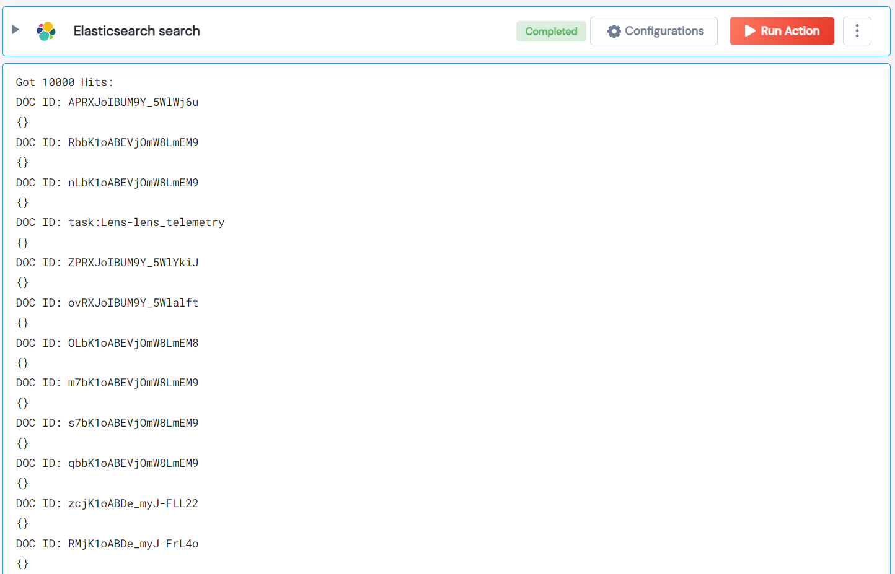

 
<h2>Elasticsearch search</h2>

 

## Description
This Lego used to Elasticsearch Search.

## Lego Details

    elasticsearch_search_query(handle: object, query: str, index: str, size: int, 
                               sort: List, fields: List)

        handle: Object of type unSkript ElasticSearch Connector
        query: Query String
        index: Index, Optional variable for the elasticsearch query
        size: Size, Optional variable Size
        sort: Sort, Optional List
        fields: Fields, Optional List

## Lego Input
This Lego take six inputs handle, query, index, size, sort and fields.

## Lego Output
Here is a sample output.

## See it in Action

You can see this Lego in action following this link [unSkript Live](https://us.app.unskript.io)